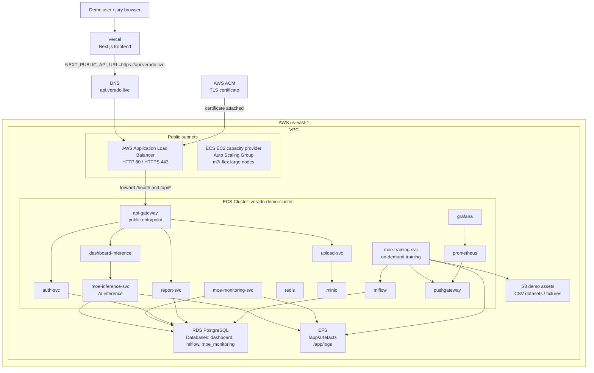
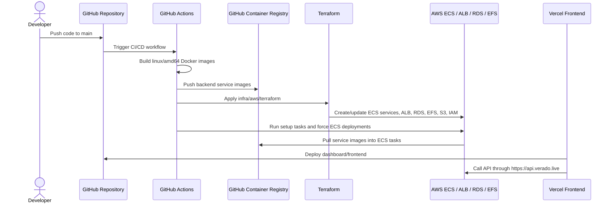
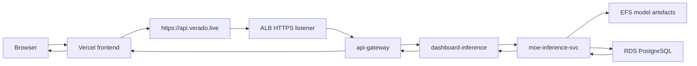

# AWS ECS-on-EC2 Demo Deployment Diagram

## Runtime Architecture

```mermaid
flowchart TB
    user["Demo user / jury browser"]
    vercel["Vercel\nNext.js frontend"]
    dns["DNS\napi.verado.live"]
    acm["AWS ACM\nTLS certificate"]
    alb["AWS Application Load Balancer\nHTTP 80 / HTTPS 443"]

    subgraph aws["AWS us-east-1"]
        subgraph vpc["VPC"]
            subgraph public_subnets["Public subnets"]
                alb
                ecs_nodes["ECS EC2 capacity provider\nAuto Scaling Group\nm7i-flex.large nodes"]
            end

            subgraph ecs["ECS Cluster: verado-demo-cluster"]
                gateway["api-gateway\npublic entrypoint"]
                auth["auth-svc"]
                upload["upload-svc"]
                dashboard_inference["dashboard-inference"]
                report["report-svc"]
                moe_inference["moe-inference-svc\nAI inference"]
                monitoring["moe-monitoring-svc"]
                training["moe-training-svc\non-demand training"]
                redis["redis"]
                minio["minio"]
                mlflow["mlflow"]
                prometheus["prometheus"]
                grafana["grafana"]
                pushgateway["pushgateway"]
            end

            rds["RDS PostgreSQL\nDatabases: dashboard, mlflow, moe_monitoring"]
            efs["EFS\n/app/artefacts\n/app/logs"]
            s3["S3 demo assets\nCSV datasets / fixtures"]
        end
    end

    user --> vercel
    vercel -->|"NEXT_PUBLIC_API_URL=https://api.verado.live"| dns
    dns --> alb
    acm -->|"certificate attached"| alb
    alb -->|"forward /health and /api/*"| gateway

    gateway --> auth
    gateway --> upload
    gateway --> dashboard_inference
    gateway --> report

    dashboard_inference --> moe_inference
    moe_inference --> efs
    moe_inference --> rds

    monitoring --> rds
    monitoring --> efs
    training --> efs
    training --> s3
    training --> mlflow
    training --> pushgateway

    auth --> rds
    upload --> minio
    report --> rds
    mlflow --> rds
    prometheus --> pushgateway
    grafana --> prometheus
```

## CI/CD Deployment Flow

```mermaid
sequenceDiagram
    actor Dev as Developer
    participant GitHub as GitHub Repository
    participant Actions as GitHub Actions
    participant GHCR as GitHub Container Registry
    participant Terraform as Terraform
    participant AWS as AWS ECS / ALB / RDS / EFS
    participant Vercel as Vercel Frontend

    Dev->>GitHub: Push code to main
    GitHub->>Actions: Trigger CI/CD workflow
    Actions->>Actions: Build linux/amd64 Docker images
    Actions->>GHCR: Push backend service images
    Actions->>Terraform: Apply infra/aws/terraform
    Terraform->>AWS: Create/update ECS services, ALB, RDS, EFS, S3, IAM
    Actions->>AWS: Run setup tasks and force ECS deployments
    AWS->>GHCR: Pull service images into ECS tasks
    Vercel->>GitHub: Deploy dashboard/frontend
    Vercel->>AWS: Call API through https://api.verado.live
```

## Demo Request Path

```mermaid
flowchart LR
    browser["Browser"]
    frontend["Vercel frontend"]
    api["https://api.verado.live"]
    alb["ALB HTTPS listener"]
    gateway["api-gateway"]
    inference_proxy["dashboard-inference"]
    moe["moe-inference-svc"]
    efs["EFS model artefacts"]
    db["RDS PostgreSQL"]

    browser --> frontend
    frontend --> api
    api --> alb
    alb --> gateway
    gateway --> inference_proxy
    inference_proxy --> moe
    moe --> efs
    moe --> db
    db --> moe
    moe --> inference_proxy
    inference_proxy --> gateway
    gateway --> frontend
    frontend --> browser
```
